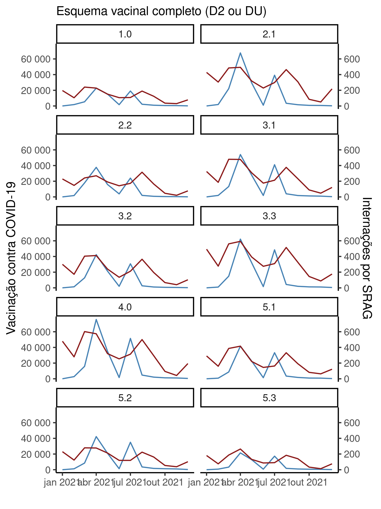
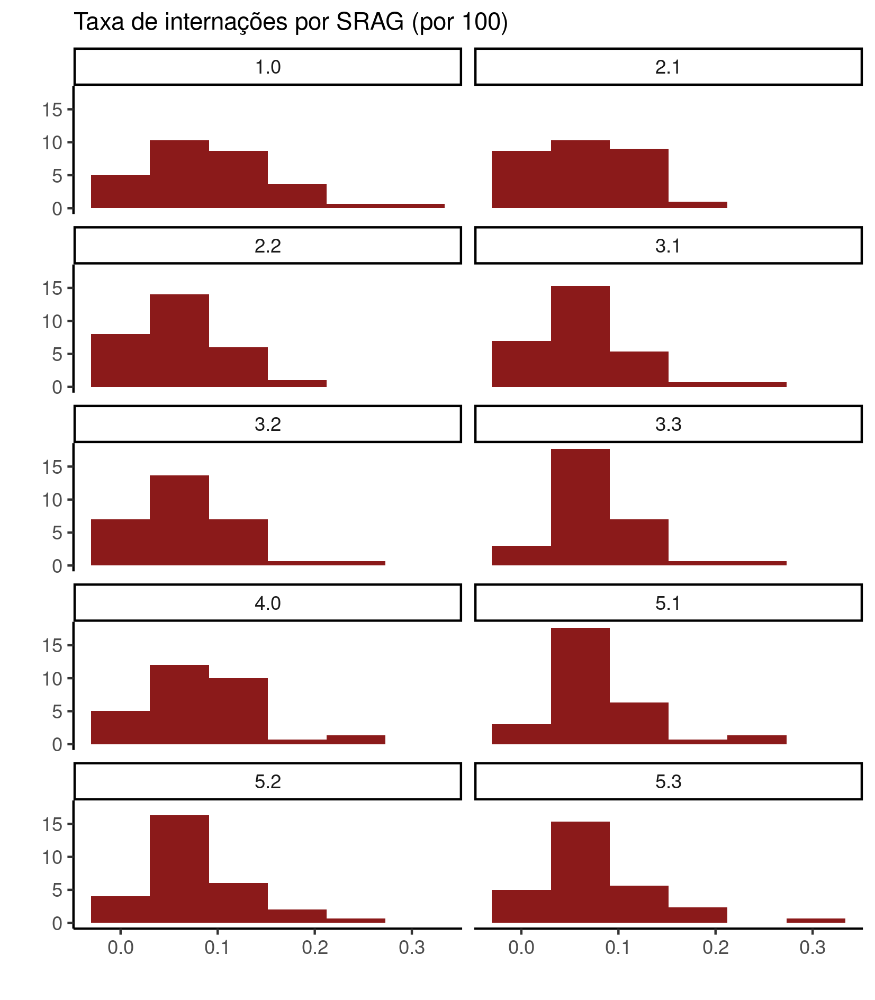

---

\newpage

**Associação entre vacinação de COVID-19 e internações por SRAG em idosos nas áreas programáticas do Rio de Janeiro/RJ em 2021**

**Histórico do documento**

|Versão |Alterações     |
|:------|:--------------|
|01     |Versão inicial |

---

# Lista de abreviaturas

- AIQ: Amplitude inter-quartil
- AP: Área programática
- CV: Coeficiente de variação
- DP: desvio padrão
- IC: intervalo de confiança
- SRAG: Síndrome respiratória aguda grave

# Contexto

## Objetivos

## Recepção e tratamento dos dados

# Metodologia

## Variáveis

### Desfechos primário e secundário

### Covariáveis

## Análises Estatísticas

Esta análise foi realizada utilizando-se o software `R` versão 4.1.3.

# Resultados

## População do estudo e acompanhamento

Conforme o Censo de 2010 as diversas AP do município do Rio de Janeiro possuíam entre
42565
e
147246
idosos, a partir de 60 anos (Tabela 1).
A AP com menor abundância de idosos era
a AP 1.0,
enquanto
a AP 2.1
possuía a maior população absoluta.
Em termos relativos
a AP 5.3
possuía a maior proporção de residentes na faixa entre
60-69 anos (59.1%),
a AP 3.2
possuía a maior proporção de residentes na faixa entre
70-79 anos (33.4%)
e a AP 2.1
possuía a maior proporção de residentes com
80 anos ou mais (23.2%).

Table: **Tabela 1** Perfil epidemiológico

|AP  |Homens        |Mulheres      |60-69 anos    |70-79 anos    |80 anos ou mais |  Total|
|:---|:-------------|:-------------|:-------------|:-------------|:---------------|------:|
|1.0 |16393 (38.5%) |26172 (61.5%) |21664 (50.9%) |13598 (31.9%) |7303 (17.2%)    |  42565|
|2.1 |53593 (36.4%) |93653 (63.6%) |65481 (44.5%) |47550 (32.3%) |34215 (23.2%)   | 147246|
|2.2 |29365 (35.8%) |52648 (64.2%) |36420 (44.4%) |27337 (33.3%) |18256 (22.3%)   |  82013|
|3.1 |45835 (39.4%) |70488 (60.6%) |61764 (53.1%) |37572 (32.3%) |16987 (14.6%)   | 116323|
|3.2 |36774 (37.6%) |61078 (62.4%) |48058 (49.1%) |32716 (33.4%) |17078 (17.5%)   |  97852|
|3.3 |54759 (38.8%) |86245 (61.2%) |74737 (53.0%) |45973 (32.6%) |20294 (14.4%)   | 141004|
|4.0 |47903 (41.3%) |68050 (58.7%) |64519 (55.6%) |35185 (30.3%) |16249 (14.0%)   | 115953|
|5.1 |33724 (39.7%) |51165 (60.3%) |46995 (55.4%) |26584 (31.3%) |11310 (13.3%)   |  84889|
|5.2 |26057 (41.1%) |37298 (58.9%) |36342 (57.4%) |19009 (30.0%) |8004 (12.6%)    |  63355|
|5.3 |21065 (42.4%) |28586 (57.6%) |29345 (59.1%) |14759 (29.7%) |5547 (11.2%)    |  49651|

A tabela 2 mostra o esforço vacinal contra COVID-19 e as internações por SRAG para todas as AP durante o período do estudo.
A amplitude da vacinação nas APs variou entre
0
e
84065
ao longo do ano de 2021.
A AP com maior número absoluto de vacinações aplicadas foi
a AP 4.0.
Com exceção da AP 2.1 todas as outras nove AP registraram zero aplicações de vacinas em pelo menos um mês.
As dez AP observaram uma média mensal de
4123 aplicações de vacinas
ao longo de 2021.

O maior número de internações em uma AP em um único mês foi
317
observado na AP 3.3 no mês de abril.
O menor número de internações foi
4
observado nas AP 2.1 e 5.3, ambas em novembro.
As dez AP observaram uma média mensal de 71 internações ao longo de 2021.

Table: **Tabela 2** Variáveis do estudo

|**Características**           |   **N = 870**   |
|:-----------------------------|:---------------:|
|__Vacinação contra COVID-19__ |                 |
|Mediana (AIQ)                 | 351 (81, 1,555) |
|Média (Desvio Padrão)         | 4,123 (10,272)  |
|Amplitude                     |    0, 84,065    |
|__Internações por SRAG__      |                 |
|Mediana (AIQ)                 |   58 (32, 98)   |
|Média (Desvio Padrão)         |     71 (53)     |
|Amplitude                     |     4, 317      |

Destaca-se a grande variabilidade do esforço vacinal, onde o
DP (10272 aplicações de vacinas)
é consideravalmente maior que a média.
Isso indica baixa consistência com que este esforço foi aplicado com sucesso nas populações destas regiões.
O CV da vacinação é 249.1% enquanto que o CV das internações é 74.7%.
As distribuições destas duas variáveis podem ser visualizadas nas figuras A1 e A2 no apêndice.

A distribuição das vacinações mensais nas AP tem forte concentração à esquerda com longa cauda à direita, exibindo características de uma distribuição Log-Normal.
<!-- Para estabilizar estas distribuições, as análises das seções seguintes utilizarão escala logarítmica para interpretar esta variável. -->

## Associação entre internações e vacinação

### Dose 1

**Figura 1** caption

**Figura 1** caption

Table: **Tabela 3** Correlações em cada faixa etária

|AP  |60-69 anos |70-79 anos |80 anos ou mais |
|:---|:----------|:----------|:---------------|
|1.0 |0.66       |0.52       |0.01            |
|2.1 |0.65       |0.42       |0.02            |
|2.2 |0.70       |0.33       |-0.03           |
|3.1 |0.73       |0.54       |-0.06           |
|3.2 |0.71       |0.40       |-0.05           |
|3.3 |0.67       |0.42       |-0.14           |
|4.0 |0.66       |0.45       |0.04            |
|5.1 |0.75       |0.55       |-0.05           |
|5.2 |0.58       |0.47       |-0.00           |
|5.3 |0.79       |0.35       |-0.01           |

### Dose 2

**Figura 3** caption

**Figura 4** caption

Table: **Tabela 4** Correlações em cada faixa etária

|AP  |60-69 anos |70-79 anos |80 anos ou mais |
|:---|:----------|:----------|:---------------|
|1.0 |0.23       |0.38       |0.16            |
|2.1 |0.32       |0.50       |0.13            |
|2.2 |0.30       |0.37       |-0.04           |
|3.1 |0.19       |0.44       |0.40            |
|3.2 |0.24       |0.45       |0.25            |
|3.3 |0.19       |0.44       |0.03            |
|4.0 |0.21       |0.38       |0.27            |
|5.1 |0.17       |0.43       |0.16            |
|5.2 |0.19       |0.44       |0.39            |
|5.3 |0.22       |0.40       |-0.08           |

### Dose de reforço

**Figura 5** caption

**Figura 6** caption

Table: **Tabela 5** Correlações em cada faixa etária

|AP  |60-69 anos |70-79 anos |80 anos ou mais |
|:---|:----------|:----------|:---------------|
|1.0 |-0.72      |-0.55      |0.11            |
|2.1 |-0.70      |-0.41      |0.19            |
|2.2 |-0.72      |-0.36      |0.11            |
|3.1 |-0.82      |-0.34      |-0.06           |
|3.2 |-0.67      |-0.40      |0.10            |
|3.3 |-0.73      |-0.46      |-0.04           |
|4.0 |-0.82      |-0.41      |-0.08           |
|5.1 |-0.77      |-0.48      |-0.16           |
|5.2 |-0.81      |-0.47      |-0.02           |
|5.3 |-0.88      |-0.48      |0.31            |

## Avaliação global

**Figura 7** caption

Table: **Tabela 6** Correlações em dose

|AP  |Dose 1 |Dose 2 ou dose única |Dose de reforço |Esquema vacinal completo (DU, D2 ou DR) |
|:---|:------|:--------------------|:---------------|:---------------------------------------|
|1.0 |0.58   |0.31                 |-0.48           |0.02                                    |
|2.1 |0.32   |0.23                 |-0.26           |-0.01                                   |
|2.2 |0.36   |0.20                 |-0.34           |-0.06                                   |
|3.1 |0.61   |0.33                 |-0.40           |0.06                                    |
|3.2 |0.55   |0.32                 |-0.41           |0.05                                    |
|3.3 |0.55   |0.30                 |-0.47           |0.02                                    |
|4.0 |0.54   |0.29                 |-0.47           |-0.00                                   |
|5.1 |0.66   |0.31                 |-0.50           |0.04                                    |
|5.2 |0.53   |0.34                 |-0.46           |0.06                                    |
|5.3 |0.65   |0.34                 |-0.46           |0.07                                    |

# Observações e limitações

# Conclusões

# Referências

- **SAP-2022-016-JB-v01** -- Plano Analítico para Associação entre vacinação de COVID-19 e internações por SRAG em idosos nas áreas programáticas do Rio de Janeiro/RJ em 2021

# Apêndice

## Análise exploratória de dados

**Figura A1** caption

**Figura A2** caption

## Disponibilidade

Tanto este documento como o plano analítico correspondente (**SAP-2022-016-JB-v01**) podem ser obtidos no seguinte endereço:

<!-- Este documento pode ser obtido no seguinte endereço: -->

<https://philsf-biostat.github.io/SAR-2022-016-JB/>

<!-- O cliente solicitou que esta análise seja mantida confidencial. -->
<!-- Tanto este documento como o plano analítico correspondente (**SAP-2022-016-JB-v01**) portanto não foram publicados online e apenas o título e o ano da análise foram incluídas no portfólio do consultor. -->
<!-- O portfólio pode ser visto em: -->

<!-- <https://philsf-biostat.github.io/> -->

## Dados utilizados

A tabela A1 mostra a estrutura  da tabela de dados analíticos.

| ap_resid | mes | fe | internacoes | dose | vacinacao |
|:--------:|:---:|:--:|:-----------:|:----:|:---------:|
|    1     |     |    |             |      |           |
|    2     |     |    |             |      |           |
|    3     |     |    |             |      |           |
|   ...    |     |    |             |      |           |
|   870    |     |    |             |      |           |

Table: **Tabela A1** Estrutura da tabela de dados analíticos

Os dados utilizados neste relatório não podem ser publicados online por questões de sigilo.
