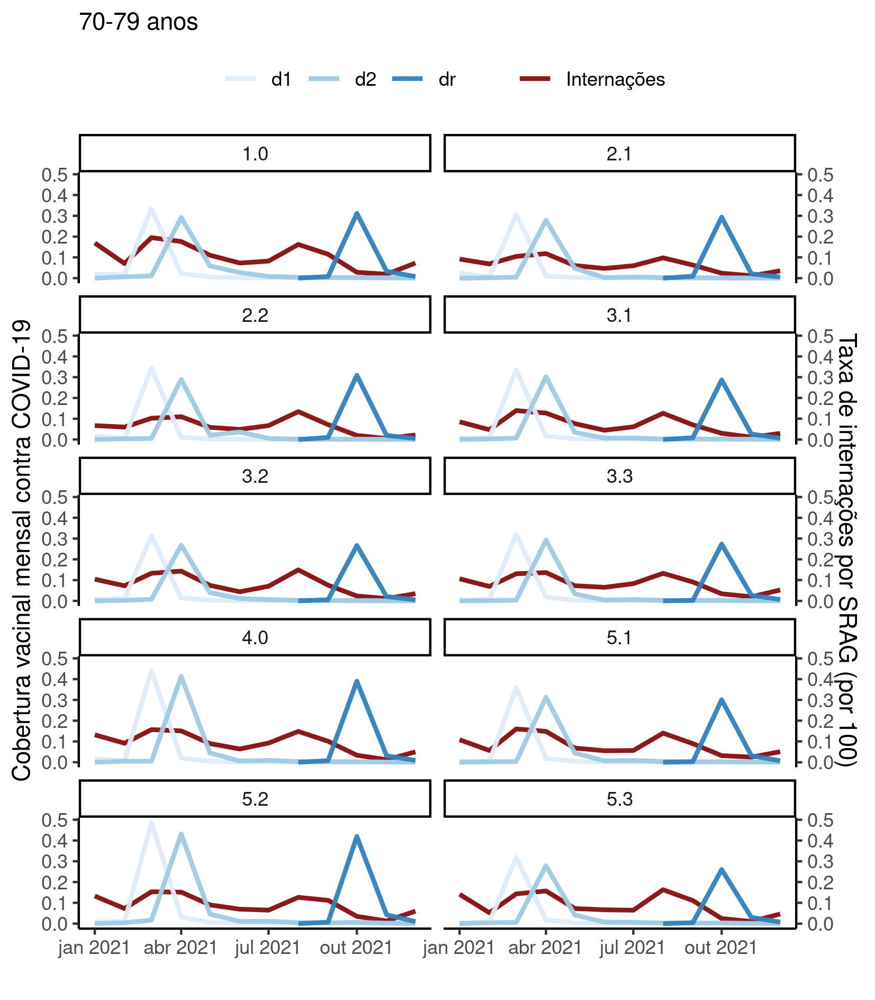

---

\newpage

**Associação entre vacinação de COVID-19 e internações por SRAG em idosos nas áreas programáticas do Rio de Janeiro/RJ em 2021**

**Histórico do documento**

|Versão |Alterações     |
|:------|:--------------|
|01     |Versão inicial |

---

# Lista de abreviaturas

- AIQ: Amplitude inter-quartil
- AP: Área programática
- CV: Coeficiente de variação
- DP: desvio padrão
- IC: intervalo de confiança
- SRAG: Síndrome respiratória aguda grave

# Contexto

## Objetivos

Correlacionar as tendências de internação hospitalar por SRAG e vacinação de COVID-19 em idosos em cada área programática do município do Rio de Janeiro em 2021.

## Recepção e tratamento dos dados

Os dados brutos de vacinação de COVID-19 e internações por SRAG foram recebidos em diversas tabelas separadas, que foram tratadas previamente à junção em uma tabela única.
As tabelas exibiam as contagens agregadas por AP em cada mês de 2021, e havia uma tabela para cada faixa etária avaliada no estudo (60-69 anos, 70-79 anos e 80 anos ou mais).
Os dados de internações vieram de uma única tabela, enquanto os dados de vacinação estavam adicionalmente segregados em tabelas por dose do esquema vacinal ("Dose 1", "Dose 2 ou dose única" e "Dose de reforço").
Todos os dados disponíveis foram submetidos aos critérios de inclusão e exclusão: apenas dados de residentes das APs e referentes ao ano de 2021 foram incluídos na tabela.
Erros de codificação de dados foram corrigidos nos processos de limpeza de dados.
No total havia uma tabela com dados de internações, nove tabelas com dados de vacinação e duas tabelas de perfil epidemiológico (por sexo e por população total).

Na primeira etapa as três tabelas de cada variável, correspondendo às três faixas etárias, foram consolidadas usando o código da AP e o mês como chave de join.
Isto resultou em uma tabela com todas as contagens de cada variável (internações e vacinação).
Na segunda etapa as duas tabelas foram consolidadas em uma tabela única com todos os valores mensais das internações e de vacinação, estratificados por AP e por mês.

Esta tabela final de dados brutos foi pós processada conforme descrito na próxima seção.
A tabela de dados de perfil epidemiológico foi mantida separada da tabela analítica (Ver observações).

Todas as variáveis da tabela de dados analíticos foram identificadas de acordo com as descrições das variáveis, e os valores foram identificados de acordo com o dicionário de dados providenciado.
Estas identificações possibilitarão a criação de tabelas de resultados com qualidade de produção final.
Os valores numéricos referentes aos meses de 2021 foram convertidos para datas putativas (primeiro dia de cada mês) para viabilizar a visualização das curvas de tendência na escala temporal de forma interpretável.

Considerando três faixas etárias, em dez AP, contabilizando três etapas do esquema vacinal durante 12 meses, o tamanho teórico da tabela de dados seria equivalente a 1080 observações.
Depois dos procedimentos de limpeza e seleção
7
variáveis foram incluídas na análise com
870
observações.
A tabela analítica não foi preenchida com valores nulos representando a estrutura maximal teórica, incluindo apenas as observações disponíveis nos dados brutos.
Nenhuma observação adicional foi excluída nesta etapa.

# Metodologia

## Variáveis

### Desfecho primário

Número total de internações por SRAG em idosos.

### Covariáveis

N/A

## Análises Estatísticas

O perfil epidemiológico das AP incluídas no estudo foi descrito na baseline, com os dados do Censo brasileiro de 2010.
As características demográficas
(sexo e faixa etária)
foram descritas como
total de residentes em cada AP.
As tendências de vacinação e de internações em cada AP foram resumidas em tabelas e visualizadas em gráficos exploratórios.
As curvas de tendência de internação hospitalar de cada uma das dez APs foram criadas para cada etapa do esquema vacinal (dose 1, dose 2 e dose de reforço), estratificando por faixas etárias (60 a 69 anos, 70 a 79 anos e 80 anos ou mais).
A associação entre os totais de vacinados e de internações em cada AP foi mensurada com o coeficiente de correlação linear de Pearson, ou a correlação de Spearman.
Todas as avaliações foram realizadas como análises de casos completos.

Esta análise foi realizada utilizando-se o software `R` versão 4.1.3.

# Resultados

## População do estudo e acompanhamento

Conforme o Censo de 2010 as diversas AP do município do Rio de Janeiro possuíam entre
42565
e
147246
idosos, a partir de 60 anos (Tabela 1).
A AP com menor abundância de idosos era
a AP 1.0,
enquanto
a AP 2.1
possuía a maior população absoluta.
Em termos relativos
a AP 5.3
possuía a maior proporção de residentes na faixa entre
60-69 anos (59.1%),
a AP 3.2
possuía a maior proporção de residentes na faixa entre
70-79 anos (33.4%)
e a AP 2.1
possuía a maior proporção de residentes com
80 anos ou mais (23.2%).

Table: **Tabela 1** Perfil epidemiológico

|AP  |Homens         |Mulheres       |60-69 anos     |70-79 anos     |80 anos ou mais |Total   |
|:---|:--------------|:--------------|:--------------|:--------------|:---------------|:-------|
|1.0 |16.393 (38.5%) |26.172 (61.5%) |21.664 (50.9%) |13.598 (31.9%) |7.303 (17.2%)   |42.565  |
|2.1 |53.593 (36.4%) |93.653 (63.6%) |65.481 (44.5%) |47.550 (32.3%) |34.215 (23.2%)  |147.246 |
|2.2 |29.365 (35.8%) |52.648 (64.2%) |36.420 (44.4%) |27.337 (33.3%) |18.256 (22.3%)  |82.013  |
|3.1 |45.835 (39.4%) |70.488 (60.6%) |61.764 (53.1%) |37.572 (32.3%) |16.987 (14.6%)  |116.323 |
|3.2 |36.774 (37.6%) |61.078 (62.4%) |48.058 (49.1%) |32.716 (33.4%) |17.078 (17.5%)  |97.852  |
|3.3 |54.759 (38.8%) |86.245 (61.2%) |74.737 (53.0%) |45.973 (32.6%) |20.294 (14.4%)  |141.004 |
|4.0 |47.903 (41.3%) |68.050 (58.7%) |64.519 (55.6%) |35.185 (30.3%) |16.249 (14.0%)  |115.953 |
|5.1 |33.724 (39.7%) |51.165 (60.3%) |46.995 (55.4%) |26.584 (31.3%) |11.310 (13.3%)  |84.889  |
|5.2 |26.057 (41.1%) |37.298 (58.9%) |36.342 (57.4%) |19.009 (30.0%) |8.004 (12.6%)   |63.355  |
|5.3 |21.065 (42.4%) |28.586 (57.6%) |29.345 (59.1%) |14.759 (29.7%) |5.547 (11.2%)   |49.651  |

<!-- A tabela 2 mostra o esforço vacinal contra COVID-19 e as internações por SRAG para todas as AP durante o período do estudo. -->

## Internações por SRAG em 2021

O maior número de internações em uma AP em um único mês foi
0,31
observado na AP 3.3 no mês de abril.
O menor número de internações foi
0,005
observado nas AP 2.1 e 5.3, ambas em novembro.
As dez AP observaram uma média mensal de 0,08 internações ao longo de 2021.

**Figura 1** Internações de idosos por SRAG em 2021 nas AP do município do Rio de Janeiro.

## Associação entre internações e vacinação

A amplitude da vacinação nas APs variou entre
0,00
e
0,92
ao longo do ano de 2021.
A AP com maior número absoluto de vacinações aplicadas foi
a AP 5.2.
Com exceção da AP 2.1 todas as outras nove AP registraram zero aplicações de vacinas em pelo menos um mês.
Globalmente, as dez AP observaram uma média mensal de
0,05 aplicações de vacinas
ao longo de 2021.

As tendências das curvas de vacinação e a associação com os números de internações por SRAG serão explorados nas próximas seções.

### Idosos 60-69 anos

**Figura 2** Aplicação da dose 1 da vacina de COVID-19 de idosos em 2021 nas AP do município do Rio de Janeiro.

Table: **Tabela xx** Média (DP) de aplicações de Dose 1, média (DP) de internações e correlação em 2021 em cada Área Programática (AP) para idosos 60-69 anos

|AP     |Dose |   N|Doses aplicadas (2021) |Internações (2021) |Correlação (2021) |
|:------|:----|---:|:----------------------|:------------------|:-----------------|
|Global |d1   | 120|0,06 (0,18)            |0,09 (0,07)        |0,66              |
|Global |d2   | 120|0,06 (0,11)            |0,09 (0,07)        |0,23              |
|Global |dr   |  50|0,12 (0,14)            |0,05 (0,04)        |-0,65             |
|1.0    |d1   |  12|0,09 (0,24)            |0,12 (0,08)        |0,66              |
|1.0    |d2   |  12|0,08 (0,14)            |0,12 (0,08)        |0,23              |
|1.0    |dr   |   5|0,15 (0,18)            |0,06 (0,05)        |-0,72             |
|2.1    |d1   |  12|0,05 (0,12)            |0,05 (0,04)        |0,65              |
|2.1    |d2   |  12|0,05 (0,08)            |0,05 (0,04)        |0,32              |
|2.1    |dr   |   5|0,10 (0,11)            |0,02 (0,02)        |-0,70             |
|2.2    |d1   |  12|0,05 (0,13)            |0,06 (0,04)        |0,70              |
|2.2    |d2   |  12|0,05 (0,09)            |0,06 (0,04)        |0,30              |
|2.2    |dr   |   5|0,11 (0,13)            |0,03 (0,03)        |-0,72             |
|3.1    |d1   |  12|0,06 (0,16)            |0,09 (0,06)        |0,73              |
|3.1    |d2   |  12|0,06 (0,10)            |0,09 (0,06)        |0,19              |
|3.1    |dr   |   5|0,11 (0,13)            |0,05 (0,03)        |-0,82             |
|3.2    |d1   |  12|0,05 (0,15)            |0,08 (0,06)        |0,71              |
|3.2    |d2   |  12|0,05 (0,09)            |0,08 (0,06)        |0,24              |
|3.2    |dr   |   5|0,10 (0,12)            |0,04 (0,04)        |-0,67             |
|3.3    |d1   |  12|0,06 (0,16)            |0,10 (0,07)        |0,67              |
|3.3    |d2   |  12|0,06 (0,10)            |0,10 (0,07)        |0,19              |
|3.3    |dr   |   5|0,11 (0,14)            |0,05 (0,04)        |-0,73             |
|4.0    |d1   |  12|0,07 (0,21)            |0,11 (0,07)        |0,66              |
|4.0    |d2   |  12|0,07 (0,13)            |0,11 (0,07)        |0,21              |
|4.0    |dr   |   5|0,14 (0,17)            |0,06 (0,05)        |-0,82             |
|5.1    |d1   |  12|0,07 (0,19)            |0,11 (0,07)        |0,75              |
|5.1    |d2   |  12|0,07 (0,12)            |0,11 (0,07)        |0,17              |
|5.1    |dr   |   5|0,12 (0,15)            |0,06 (0,04)        |-0,77             |
|5.2    |d1   |  12|0,09 (0,26)            |0,11 (0,07)        |0,58              |
|5.2    |d2   |  12|0,09 (0,16)            |0,11 (0,07)        |0,19              |
|5.2    |dr   |   5|0,17 (0,21)            |0,07 (0,04)        |-0,81             |
|5.3    |d1   |  12|0,06 (0,17)            |0,11 (0,08)        |0,79              |
|5.3    |d2   |  12|0,06 (0,10)            |0,11 (0,08)        |0,22              |
|5.3    |dr   |   5|0,11 (0,14)            |0,07 (0,05)        |-0,88             |

### Idosos 70-79 anos

**Figura 3** Aplicação da dose 2 (ou dose única) da vacina de COVID-19 de idosos em 2021 nas AP do município do Rio de Janeiro.

Table: **Tabela xx** Média (DP) de aplicações de Dose 2 ou dose única, média (DP) de internações e correlação em 2021 em cada Área Programática (AP) para idosos 60-69 anos

|AP     |Dose |   N|Doses aplicadas (2021) |Internações (2021) |Correlação (2021) |
|:------|:----|---:|:----------------------|:------------------|:-----------------|
|Global |d1   | 120|0,03 (0,10)            |0,08 (0,05)        |0,43              |
|Global |d2   | 120|0,03 (0,09)            |0,08 (0,05)        |0,40              |
|Global |dr   |  50|0,07 (0,12)            |0,06 (0,05)        |-0,41             |
|1.0    |d1   |  12|0,03 (0,09)            |0,11 (0,06)        |0,52              |
|1.0    |d2   |  12|0,03 (0,08)            |0,11 (0,06)        |0,38              |
|1.0    |dr   |   5|0,07 (0,13)            |0,08 (0,06)        |-0,55             |
|2.1    |d1   |  12|0,03 (0,09)            |0,07 (0,03)        |0,42              |
|2.1    |d2   |  12|0,03 (0,08)            |0,07 (0,03)        |0,50              |
|2.1    |dr   |   5|0,07 (0,13)            |0,05 (0,03)        |-0,41             |
|2.2    |d1   |  12|0,03 (0,10)            |0,06 (0,04)        |0,33              |
|2.2    |d2   |  12|0,03 (0,08)            |0,06 (0,04)        |0,37              |
|2.2    |dr   |   5|0,07 (0,13)            |0,05 (0,05)        |-0,36             |
|3.1    |d1   |  12|0,03 (0,10)            |0,07 (0,04)        |0,54              |
|3.1    |d2   |  12|0,03 (0,09)            |0,07 (0,04)        |0,44              |
|3.1    |dr   |   5|0,07 (0,12)            |0,05 (0,05)        |-0,34             |
|3.2    |d1   |  12|0,03 (0,09)            |0,08 (0,05)        |0,40              |
|3.2    |d2   |  12|0,03 (0,08)            |0,08 (0,05)        |0,45              |
|3.2    |dr   |   5|0,06 (0,12)            |0,06 (0,06)        |-0,40             |
|3.3    |d1   |  12|0,03 (0,09)            |0,08 (0,04)        |0,42              |
|3.3    |d2   |  12|0,03 (0,08)            |0,08 (0,04)        |0,44              |
|3.3    |dr   |   5|0,06 (0,12)            |0,07 (0,05)        |-0,46             |
|4.0    |d1   |  12|0,04 (0,13)            |0,09 (0,05)        |0,45              |
|4.0    |d2   |  12|0,04 (0,12)            |0,09 (0,05)        |0,38              |
|4.0    |dr   |   5|0,09 (0,17)            |0,07 (0,06)        |-0,41             |
|5.1    |d1   |  12|0,03 (0,10)            |0,08 (0,05)        |0,55              |
|5.1    |d2   |  12|0,03 (0,09)            |0,08 (0,05)        |0,43              |
|5.1    |dr   |   5|0,07 (0,13)            |0,07 (0,05)        |-0,48             |
|5.2    |d1   |  12|0,05 (0,14)            |0,09 (0,05)        |0,47              |
|5.2    |d2   |  12|0,04 (0,12)            |0,09 (0,05)        |0,44              |
|5.2    |dr   |   5|0,10 (0,18)            |0,07 (0,05)        |-0,47             |
|5.3    |d1   |  12|0,03 (0,09)            |0,09 (0,05)        |0,35              |
|5.3    |d2   |  12|0,03 (0,08)            |0,09 (0,05)        |0,40              |
|5.3    |dr   |   5|0,06 (0,11)            |0,07 (0,06)        |-0,48             |

### Idosos 80 anos ou mais

**Figura 4** Aplicação da dose de reforço da vacina de COVID-19 de idosos em 2021 nas AP do município do Rio de Janeiro.

Table: **Tabela xx** Média (DP) de aplicações de Dose de reforço, média (DP) de internações e correlação em 2021 em cada Área Programática (AP) para idosos 60-69 anos

|AP     |Dose |   N|Doses aplicadas (2021) |Internações (2021) |Correlação (2021) |
|:------|:----|---:|:----------------------|:------------------|:-----------------|
|Global |d1   | 120|0,02 (0,05)            |0,07 (0,03)        |0,00              |
|Global |d2   | 120|0,02 (0,04)            |0,07 (0,03)        |0,17              |
|Global |dr   |  50|0,03 (0,05)            |0,06 (0,04)        |0,08              |
|1.0    |d1   |  12|0,02 (0,05)            |0,09 (0,04)        |0,01              |
|1.0    |d2   |  12|0,02 (0,03)            |0,09 (0,04)        |0,16              |
|1.0    |dr   |   5|0,03 (0,05)            |0,07 (0,05)        |0,11              |
|2.1    |d1   |  12|0,02 (0,06)            |0,09 (0,04)        |0,02              |
|2.1    |d2   |  12|0,02 (0,04)            |0,09 (0,04)        |0,13              |
|2.1    |dr   |   5|0,04 (0,07)            |0,08 (0,06)        |0,19              |
|2.2    |d1   |  12|0,03 (0,08)            |0,08 (0,04)        |-0,03             |
|2.2    |d2   |  12|0,03 (0,06)            |0,08 (0,04)        |-0,04             |
|2.2    |dr   |   5|0,05 (0,08)            |0,07 (0,06)        |0,11              |
|3.1    |d1   |  12|0,02 (0,05)            |0,06 (0,03)        |-0,06             |
|3.1    |d2   |  12|0,02 (0,03)            |0,06 (0,03)        |0,40              |
|3.1    |dr   |   5|0,03 (0,05)            |0,05 (0,04)        |-0,06             |
|3.2    |d1   |  12|0,02 (0,05)            |0,07 (0,03)        |-0,05             |
|3.2    |d2   |  12|0,02 (0,04)            |0,07 (0,03)        |0,25              |
|3.2    |dr   |   5|0,03 (0,05)            |0,06 (0,04)        |0,10              |
|3.3    |d1   |  12|0,02 (0,05)            |0,06 (0,03)        |-0,14             |
|3.3    |d2   |  12|0,01 (0,03)            |0,06 (0,03)        |0,03              |
|3.3    |dr   |   5|0,03 (0,04)            |0,06 (0,04)        |-0,04             |
|4.0    |d1   |  12|0,02 (0,07)            |0,08 (0,04)        |0,04              |
|4.0    |d2   |  12|0,02 (0,04)            |0,08 (0,04)        |0,27              |
|4.0    |dr   |   5|0,04 (0,07)            |0,06 (0,05)        |-0,08             |
|5.1    |d1   |  12|0,02 (0,05)            |0,06 (0,03)        |-0,05             |
|5.1    |d2   |  12|0,02 (0,03)            |0,06 (0,03)        |0,16              |
|5.1    |dr   |   5|0,03 (0,04)            |0,06 (0,04)        |-0,16             |
|5.2    |d1   |  12|0,02 (0,06)            |0,06 (0,02)        |0,00              |
|5.2    |d2   |  12|0,02 (0,04)            |0,06 (0,02)        |0,39              |
|5.2    |dr   |   5|0,04 (0,05)            |0,05 (0,03)        |-0,02             |
|5.3    |d1   |  12|0,01 (0,03)            |0,05 (0,02)        |-0,01             |
|5.3    |d2   |  12|0,01 (0,02)            |0,05 (0,02)        |-0,08             |
|5.3    |dr   |   5|0,02 (0,03)            |0,04 (0,03)        |0,31              |

<!-- ## Avaliação global -->

# Observações e limitações

**Perfil epidemiológico estático**

Os dados utilizados para a descrição do perfil epidemiológico dos idosos neste estudo vêm do Censo 2010, e portando não variam ao longo do ano de 2021.
Por este motivo, não foi possível utilizar o sexo e o tamanho da população como covariáveis para ajustar a incidência de casos de SRAG.
Por este motivo apenas o número de casos foi reportado nesta análise.

**Censo desatualizado**

Além do mencionado acima, os dados que descrevem o perfil estão desatualizados em relação aos valores reais da população alvo.
Isto introduziria um risco de viés em estimativas de incidência de SRAG pois, se a população atual for maior que a população descrita em 2010, a taxa de incidência com base nos casos de 2021 será menor que o avaliado com os dados disponíveis.
Por este motivo apenas o número de casos foi reportado nesta análise.

# Conclusões

# Referências

- **SAP-2022-016-JB-v01** -- Plano Analítico para Associação entre vacinação de COVID-19 e internações por SRAG em idosos nas áreas programáticas do Rio de Janeiro/RJ em 2021

# Apêndice

## Análise exploratória de dados

As figuras A1 e A2 mostram os histogramas das duas principais variáveis da análise.

**Figura A1** caption

Destaca-se a grande variabilidade do esforço vacinal, onde o
DP (0 aplicações de vacinas)
é consideravalmente maior que a média.
Isso indica baixa consistência com que este esforço foi aplicado com sucesso nas populações destas regiões.
O CV da vacinação é 241.1% enquanto que o CV das internações é 66.2%.
As distribuições destas duas variáveis podem ser visualizadas nas figuras A1 e A2 no apêndice.
A distribuição das vacinações mensais nas AP tem forte concentração à esquerda com longa cauda à direita, exibindo características de uma distribuição Log-Normal.
<!-- Para estabilizar estas distribuições, as análises das seções seguintes utilizarão escala logarítmica para interpretar esta variável. -->

**Figura A2** caption

## Disponibilidade

Tanto este documento como o plano analítico correspondente (**SAP-2022-016-JB-v01**) podem ser obtidos no seguinte endereço:

<!-- Este documento pode ser obtido no seguinte endereço: -->

<https://philsf-biostat.github.io/SAR-2022-016-JB/>

<!-- O cliente solicitou que esta análise seja mantida confidencial. -->
<!-- Tanto este documento como o plano analítico correspondente (**SAP-2022-016-JB-v01**) portanto não foram publicados online e apenas o título e o ano da análise foram incluídas no portfólio do consultor. -->
<!-- O portfólio pode ser visto em: -->

<!-- <https://philsf-biostat.github.io/> -->

## Dados utilizados

A tabela A1 mostra a estrutura  da tabela de dados analíticos.

| ap_resid | total | mes | fe | internacoes | dose | vacinacao |
|:--------:|:-----:|:---:|:--:|:-----------:|:----:|:---------:|
|    1     |       |     |    |             |      |           |
|    2     |       |     |    |             |      |           |
|    3     |       |     |    |             |      |           |
|   ...    |       |     |    |             |      |           |
|   870    |       |     |    |             |      |           |

Table: **Tabela A1** Estrutura da tabela de dados analíticos

Os dados utilizados neste relatório não podem ser publicados online por questões de sigilo.
