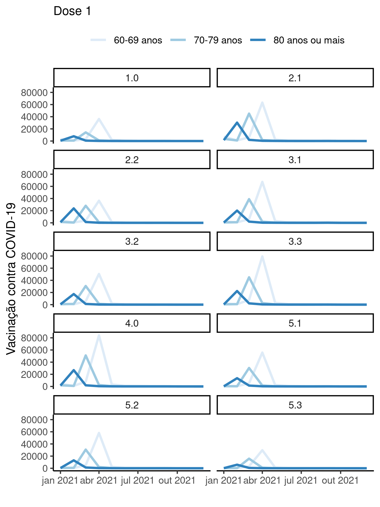

---

\newpage

**Associação entre vacinação de COVID-19 e internações por SRAG em idosos nas áreas programáticas do Rio de Janeiro/RJ em 2021**

**Histórico do documento**

|Versão |Alterações     |
|:------|:--------------|
|01     |Versão inicial |

---

# Lista de abreviaturas

# Contexto

## Objetivos

## Recepção e tratamento dos dados

# Metodologia

## Variáveis

### Desfechos primário e secundário

### Covariáveis

## Análises Estatísticas

Esta análise foi realizada utilizando-se o software `R` versão 4.1.3.

# Resultados

## População do estudo e acompanhamento

## Associação entre internações e vacinação

### Dose 1

**Figura 1** caption

**Figura 1** caption

`summarise()` has grouped output by 'ap_resid'. You can override using the
`.groups` argument.

| ap_resid |  f1  |  f2  |  f3   |
|:--------:|:----:|:----:|:-----:|
|   1.0    | 0.66 | 0.52 | 0.01  |
|   2.1    | 0.65 | 0.42 | 0.02  |
|   2.2    | 0.70 | 0.33 | -0.03 |
|   3.1    | 0.73 | 0.54 | -0.06 |
|   3.2    | 0.71 | 0.40 | -0.05 |
|   3.3    | 0.67 | 0.42 | -0.14 |
|   4.0    | 0.66 | 0.45 | 0.04  |
|   5.1    | 0.75 | 0.55 | -0.05 |
|   5.2    | 0.58 | 0.47 | -0.00 |
|   5.3    | 0.79 | 0.35 | -0.01 |

Table: **Tabela 1** Correlações em cada faixa etária

### Dose 2

### Dose 3

## Todas as faixas etárias

# Observações e limitações

# Conclusões

# Referências

- **SAP-2022-016-JB-v01** -- Plano Analítico para Associação entre vacinação de COVID-19 e internações por SRAG em idosos nas áreas programáticas do Rio de Janeiro/RJ em 2021

# Apêndice

## Análise exploratória de dados

## Disponibilidade

Tanto este documento como o plano analítico correspondente (**SAP-2022-016-JB-v01**) podem ser obtidos no seguinte endereço:

<!-- Este documento pode ser obtido no seguinte endereço: -->

<https://philsf-biostat.github.io/SAR-2022-016-JB/>

<!-- O cliente solicitou que esta análise seja mantida confidencial. -->
<!-- Tanto este documento como o plano analítico correspondente (**SAP-2022-016-JB-v01**) portanto não foram publicados online e apenas o título e o ano da análise foram incluídas no portfólio do consultor. -->
<!-- O portfólio pode ser visto em: -->

<!-- <https://philsf-biostat.github.io/> -->

## Dados utilizados

A tabela A1 mostra a estrutura  da tabela de dados analíticos.

| ap_resid | mes | fe | internacoes | dose | vacinacao |
|:--------:|:---:|:--:|:-----------:|:----:|:---------:|
|    1     |     |    |             |      |           |
|    2     |     |    |             |      |           |
|    3     |     |    |             |      |           |
|   ...    |     |    |             |      |           |
|   870    |     |    |             |      |           |

Table: **Tabela A1** Estrutura da tabela de dados analíticos

Os dados utilizados neste relatório não podem ser publicados online por questões de sigilo.
