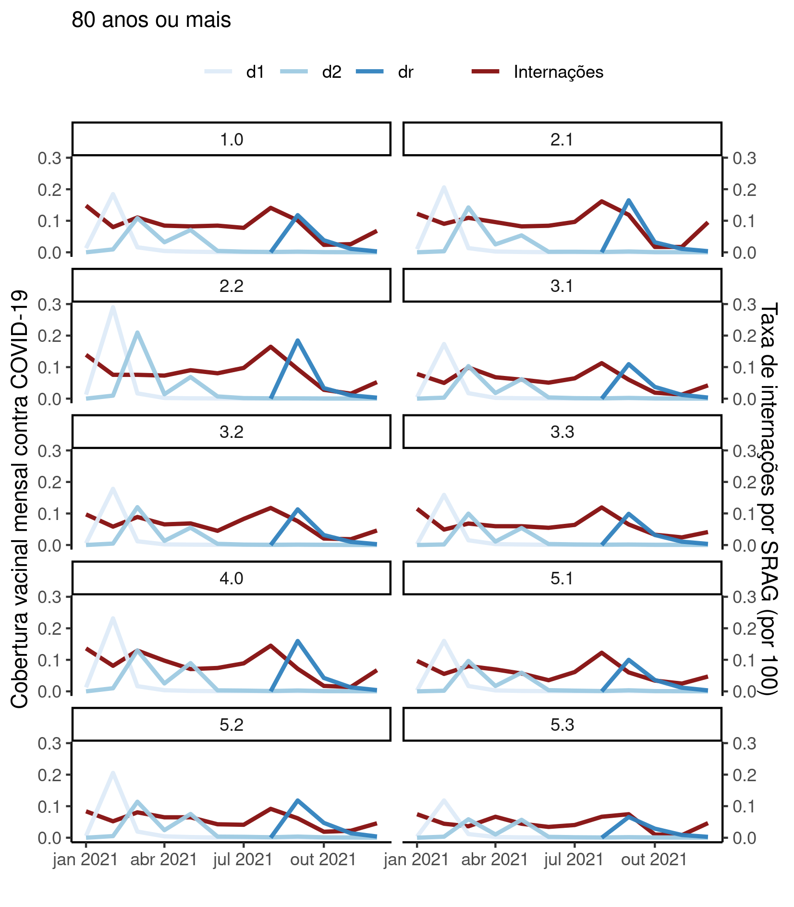

---

\newpage

**Associação entre vacinação de COVID-19 e internações por SRAG em idosos nas áreas programáticas do Rio de Janeiro/RJ em 2021**

**Histórico do documento**

|Versão |Alterações                                                    |
|:------|:-------------------------------------------------------------|
|01     |Versão inicial                                                |
|02     |Nova metodologia estatística usando regressão linear múltipla |

---

# Lista de abreviaturas

- AIQ: Amplitude inter-quartil
- AP: Área programática
- CV: Coeficiente de variação
- DP: desvio padrão
- IC: intervalo de confiança
- SRAG: Síndrome respiratória aguda grave

# Contexto

## Objetivos

Quantificar a associação entre as taxas de internação hospitalar por SRAG e a cobertura mensal da vacinação de COVID-19 em idosos em cada área programática do município do Rio de Janeiro em 2021.

## Recepção e tratamento dos dados

Os dados brutos de vacinação de COVID-19 e internações por SRAG foram recebidos em diversas tabelas separadas, que foram tratadas previamente à junção em uma tabela única.
As tabelas exibiam as contagens agregadas por AP em cada mês de 2021, e havia uma tabela para cada faixa etária avaliada no estudo (60-69 anos, 70-79 anos e 80 anos ou mais).
Os dados de internações vieram de uma única tabela, enquanto os dados de vacinação estavam adicionalmente segregados em tabelas por dose do esquema vacinal ("Dose 1", "Dose 2 ou dose única" e "Dose de reforço").
Todos os dados disponíveis foram submetidos aos critérios de inclusão e exclusão: apenas dados de residentes das APs e referentes ao ano de 2021 foram incluídos na tabela.
Erros de codificação de dados foram corrigidos nos processos de limpeza de dados.
No total havia uma tabela com dados de internações, nove tabelas com dados de vacinação e duas tabelas de perfil epidemiológico (por sexo e por população total).

Na primeira etapa as três tabelas de cada variável, correspondendo às três faixas etárias, foram consolidadas usando o código da AP e o mês como chave de join.
Isto resultou em uma tabela com todas as contagens de cada variável (internações e vacinação).
Na segunda etapa as duas tabelas foram consolidadas em uma tabela única com todos os valores mensais das internações e de vacinação, estratificados por AP e por mês.

Esta tabela final de dados brutos foi pós processada conforme descrito na próxima seção.
A tabela de dados de perfil epidemiológico foi mantida separada da tabela analítica (Ver observações).

Os totais de vacinas aplicadas e de internações em cada mês foram convertidos em taxas calculando-se a proporção entre os totais mensais e a população total de idosos por AP (considerando as populações residentes em 2010).
As taxas de internação receberam o ajuste de unidade para representar taxa por 100 habitantes.

Os valores numéricos referentes aos meses de 2021 foram convertidos para datas putativas (primeiro dia de cada mês) para viabilizar a visualização das curvas de tendência na escala temporal de forma interpretável.

Considerando três faixas etárias, em dez AP, contabilizando três etapas do esquema vacinal durante 12 meses, o tamanho teórico da tabela de dados seria equivalente a 1080 observações.
Depois dos procedimentos de limpeza e seleção
7
variáveis foram incluídas na análise com
870
observações.
A tabela analítica não foi preenchida com valores nulos representando a estrutura maximal teórica, incluindo apenas as observações disponíveis nos dados brutos.
Nenhuma observação adicional foi excluída nesta etapa.

# Metodologia

## Parâmetros do estudo

### Desenho do estudo

Estudo ecológico longitudinal, com dados agregados das dez AP do município do Rio de Janeiro.

### Critérios de inclusão e exclusão

N/A

### Exposições

Cobertura vacinal mensal de vacinação contra COVID-19.

### Desfechos

Taxa de internações por qualquer SRAG em idosos, por 100 habitantes.

### Covariáveis

A direção e força da associação entre a cobertura da vacinação contra COVID-19 serão controladas pela faixa etária, etapa do esquema vacinal (dose 1, dose 2 ou única e dose de reforço) e pela estrutura geográfica definida pela AP de residência.

## Análises Estatísticas

O perfil epidemiológico das AP incluídas no estudo foi descrito na baseline, com os dados do Censo brasileiro de 2010.
As características demográficas
(sexo e faixa etária)
foram descritas como
total de residentes em cada AP.
As tendências de vacinação e de internações em cada AP foram resumidas em tabelas e visualizadas em gráficos exploratórios.
As curvas de tendência de internação hospitalar de cada uma das dez APs foram criadas para cada uma das faixas etárias (60 a 69 anos, 70 a 79 anos e 80 anos ou mais), estratificando por etapa do esquema vacinal (dose 1, dose 2 e dose de reforço).

Modelos de regressão linear múltipla serão usados para estimar a associação entre a cobertura vacinal mensal e a taxa de internação por SRAG.
A estimativa inicial assume diferenças do efeito de cada dose na taxa de internações como variável dependente.
Para considerar o efeito longitudinal das diferentes etapas do esquema vacinal, planeja-se incluir termos de interação entre as doses e as coberturas vacinais mensais.
Além disso, para permitir que cada aplicação de doses diferentes varie independente das outras, uma variável indicadora do mês será incluída interagindo com ambos os termos.
Esta estratégia permite isolar os efeitos de cobertura vacinal em cada dose ao longo do ano.
Para avaliar os impactos da estrutura geográfica e da estrutura etária, planeja-se criar outros dois modelos, acrescentando cada a AP e a faixa etária em cada, como variável de controle.
Esta abordagem permite isolar o impacto de cada covariável na estimativa inicial.
O modelo final incluirá simultaneamente o componente longitudinal da cobertura vacinal como variável independente e as variáveis de controle.
Por simplicidade apenas as inclinações da variável independente serão interpretadas, de forma descritiva.
O modelo completo será apresentado no apêndice.

Todas as avaliações foram realizadas como análises de casos completos.
Todas as análises foram realizadas ao nível de significância de 5%.
Todos os testes de hipóteses e intervalos de confiança calculados foram
bicaudais.

Esta análise foi realizada utilizando-se o software `R` versão 4.1.3.

# Resultados

## População do estudo e acompanhamento

Conforme o Censo de 2010 as diversas AP do município do Rio de Janeiro possuíam entre
42.565
e
147.246
idosos, a partir de 60 anos (Tabela 1).
A AP com menor abundância de idosos era
a AP 1.0,
enquanto
a AP 2.1
possuía a maior população absoluta.
Em termos relativos
a AP 5.3
possuía a maior proporção de residentes na faixa entre
60-69 anos (59.1%),
a AP 3.2
possuía a maior proporção de residentes na faixa entre
70-79 anos (33.4%)
e a AP 2.1
possuía a maior proporção de residentes com
80 anos ou mais (23.2%).

Table: **Tabela 1** Perfil epidemiológico

|AP  |Homens         |Mulheres       |60-69 anos     |70-79 anos     |80 anos ou mais |Total   |
|:---|:--------------|:--------------|:--------------|:--------------|:---------------|:-------|
|1.0 |16.393 (38.5%) |26.172 (61.5%) |21.664 (50.9%) |13.598 (31.9%) |7.303 (17.2%)   |42.565  |
|2.1 |53.593 (36.4%) |93.653 (63.6%) |65.481 (44.5%) |47.550 (32.3%) |34.215 (23.2%)  |147.246 |
|2.2 |29.365 (35.8%) |52.648 (64.2%) |36.420 (44.4%) |27.337 (33.3%) |18.256 (22.3%)  |82.013  |
|3.1 |45.835 (39.4%) |70.488 (60.6%) |61.764 (53.1%) |37.572 (32.3%) |16.987 (14.6%)  |116.323 |
|3.2 |36.774 (37.6%) |61.078 (62.4%) |48.058 (49.1%) |32.716 (33.4%) |17.078 (17.5%)  |97.852  |
|3.3 |54.759 (38.8%) |86.245 (61.2%) |74.737 (53.0%) |45.973 (32.6%) |20.294 (14.4%)  |141.004 |
|4.0 |47.903 (41.3%) |68.050 (58.7%) |64.519 (55.6%) |35.185 (30.3%) |16.249 (14.0%)  |115.953 |
|5.1 |33.724 (39.7%) |51.165 (60.3%) |46.995 (55.4%) |26.584 (31.3%) |11.310 (13.3%)  |84.889  |
|5.2 |26.057 (41.1%) |37.298 (58.9%) |36.342 (57.4%) |19.009 (30.0%) |8.004 (12.6%)   |63.355  |
|5.3 |21.065 (42.4%) |28.586 (57.6%) |29.345 (59.1%) |14.759 (29.7%) |5.547 (11.2%)   |49.651  |

<!-- A tabela 2 mostra o esforço vacinal contra COVID-19 e as internações por SRAG para todas as AP durante o período do estudo. -->

## Internações por SRAG em 2021

A maior taxa de internações por SRAG em uma AP em um único mês foi
0,31
por 100 habitantes, observada na AP 3.3 no mês de abril.
A menor taxa de internações foi
0,005
(por 100) observada na AP 2.2 em novembro.
Ao todo, o município do Rio de Janeiro observou uma média mensal de 0,08 internações por 100 habitantes ao longo de 2021.

A figura 1 mostra as tendências de internações por SRAG nas dez AP ao longo de 2021 segregando as faixas etárias de idosos.
Observa-se duas ondas distintas de internações afetando similarmente as três faixas etárias consideradas no estudo, a primeira entre os meses de março e abril e a segunda entre os meses de agosto e setembro.

**Figura 1** Taxas de internações de idosos por SRAG em 2021 nas AP do município do Rio de Janeiro, por 100 habitantes.

Além das duas ondas é possível observar também uma tendência de aumento nas taxas de internações no mês de dezembro em todas as AP.
Essas tendências parecem ser mais pronunciadas nas faixas etárias com mais idade, particularmente 80 anos ou mais.

Estas tendências de internação serão contrapostas com as curvas de cobertura vacinal mensal na próxima seção.

## Cobertura vacinal contra COVID-19

A amplitude da vacinação nas APs variou entre
0,00
e
0,92
ao longo do ano de 2021.
A AP com maior número absoluto de vacinações aplicadas foi
a AP 5.2,
representando a cobertura vacinal de
0,92 em sua população de idosos.
Com exceção da AP 2.1 todas as outras nove AP registraram zero aplicações de vacinas em pelo menos um mês.

Ao todo, o município do Rio de Janeiro observou uma cobertura vacinal mensal média de
0,05
ao longo de 2021.
<!-- As tendências das curvas de cobertura vacinal mensal e a associação com os números de internações por SRAG serão explorados nas próximas seções. -->

### Idosos 60-69 anos

Quando consideramos apenas a faixa etária de
60-69 anos
observamos as etapas do esquema vacinal em ondas distintas.
O pico do esforço vacinal da primeira dose ocorreu em
abril,
da segunda dose (ou dose única) em
julho e
da dose de reforço
entre outubro e novembro.

**Figura 2** Cobertura vacinal mensal contra COVID-19 e taxa de internação de idosos em 2021 60-69 nas AP do município do Rio de Janeiro.

No município do Rio de Janeiro a correlação entre a cobertura vacinal do esquema completo (dose 2 ou dose única) e a taxa de internações foi
0,23,
indicando que as ondas de esforço vacinal acompanharam
fracamente
as ondas de internações por SRAG.

### Idosos 70-79 anos

Quando consideramos apenas a faixa etária de
70-79 anos
observamos as etapas do esquema vacinal em ondas distintas.
O pico do esforço vacinal da primeira dose ocorreu em
março,
da segunda dose (ou dose única) em
abril e
da dose de reforço
em outubro.

**Figura 3** Cobertura vacinal mensal contra COVID-19 e taxa de internação de idosos em 2021 70-79 nas AP do município do Rio de Janeiro.

No município do Rio de Janeiro a correlação entre a cobertura vacinal do esquema completo (dose 2 ou dose única) e a taxa de internações foi
0,40,
indicando que as ondas de esforço vacinal acompanharam
moderadamente
as ondas de internações por SRAG.

### Idosos 80 anos ou mais

Quando consideramos apenas a faixa etária de
70-79 anos
observamos as etapas do esquema vacinal em ondas distintas.
O pico do esforço vacinal da primeira dose ocorreu
em fevereiro,
da segunda dose (ou dose única)
entre março e maio
e da dose de reforço
em setembro.

**Figura 4** Cobertura vacinal mensal contra COVID-19 e taxa de internação de idosos em 2021 80 anos ou mais nas AP do município do Rio de Janeiro.

No município do Rio de Janeiro a correlação entre a cobertura vacinal do esquema completo (dose 2 ou dose única) e a taxa de internações foi
0,17,
indicando que as ondas de esforço vacinal acompanharam
fracamente
as ondas de internações por SRAG.

## Relação entre internações por SRAG e vacinação contra COVID-19

Foram ajustados quatro modelos de regressão linear múltipla para avaliar a associação entre a cobertura vacinal mensal de COVID-19 e as taxas mensais de internação por SRAG.
Isto indica que um aumento na cobertura vacinal contra COVID-19 estão associadas com diminuições nas taxas de internação por SRAG.

A estimativa inicial avalia a cobertura vacinal como fator de proteção contra a internação por SRAG, mas ocorreu de forma não constante ao longo dos meses de 2021.
São consideradas nesta estimativa as diferentes doses e a estrutura temporal dos dados, isolando as contribuições de cada diferente dose de vacina aplicadas em cada mês.
A inclinação da regressão linear é negativa, estimada em
-0,41 (variando entre -0,60 e -0,21, significativamente acima de zero).
Isto pode ser interpretado como: cada acréscimo de 1% na cobertura vacinal está associada com um decréscimo de
0,41
na taxa de internação por SRAG.
Este modelo explica
45.3%
da variância observada (R2 ajustado).

Ao controlar pela estrutura geográfica (aqui representada pelas AP) a redução na taxa de internações é levemente alterada para
-0,40 (entre -0,59 e -0,21).
Ao controlar pela estrutura etária da população idosa a redução na taxa de internações sobre uma alteração de maior magnitude para
-0,35 (entre -0,55 e -0,15).
O R2 ajustado do modelo geográfico é
48.2%
e que o R2 ajustado do modelo etário é
46.5%.

O modelo final incorpora a estrutura longidutinal do esforço vacinal, controlando pelas estruturas geográfica e etária dos idosos.
A inclinação da cobertura vacinal neste modelo é
-0,34 (entre -0,53 e -0,15).
Este modelo explica
49.5%
da variância observada.

Table: **Tabela 2** Associação entre cobertura vacinal mensal contra COVID-19 e taxas de internação por SRAG (por 100 habitantes) em 2021.

|**Características**         | **Beta** |   **95% IC**   | **Valor p** |
|:---------------------------|:--------:|:--------------:|:-----------:|
|Vacinação                   |  -0.41   | -0.60 to -0.21 |   <0.001    |
|Controlada por AP           |  -0.40   | -0.59 to -0.21 |   <0.001    |
|Controlada por faixa etária |  -0.35   | -0.55 to -0.15 |   <0.001    |
|Modelo final (completo)     |  -0.34   | -0.53 to -0.15 |   <0.001    |

Ao isolar o efeito da estrutura espacial e da estrutura etária na relação entre a vacinação contra COVID-19 e internação por SRAG, observamos que a estrutura etária parece ter um efeito modesto na estimativa enquanto a faixa etária a altera de forma mais pronunciada.
Naturalmente ao controlar por ambas covariáveis a estimativa final é substancialmente diferente da estimativa inicial.
Adicionalmente o R2 ajustado do modelo final é maior que o observado no modelo inicial, indicando melhor ajuste aos dados e maior poder de explicação.
É importante lembrar que as internações sob análise não são exclusivamente de COVID-19, mas todas as SRAG.

# Observações e limitações

**Perfil epidemiológico estático**

Os dados utilizados para a descrição do perfil epidemiológico dos idosos neste estudo vêm do Censo 2010, e portando não variam ao longo do ano de 2021.
Por este motivo, não foi possível utilizar o sexo e o tamanho da população como covariáveis para ajustar a incidência de casos de SRAG.
Por este motivo apenas o número de casos foi reportado nesta análise.

**Censo desatualizado**

Além do mencionado acima, os dados que descrevem o perfil estão desatualizados em relação aos valores reais da população alvo.
Isto introduziria um risco de viés em estimativas de incidência de SRAG pois, se a população atual for maior que a população descrita em 2010, a taxa de incidência com base nos casos de 2021 será menor que o avaliado com os dados disponíveis.
Por este motivo apenas o número de casos foi reportado nesta análise.

**Guideline recomendado de relato completo**

A adoção dos guidelines de relato da rede EQUATOR (<http://www.equator-network.org/>) têm sido ampliada em revistas científicas.
Recomenda-se que todos os estudos observacionais sigam o guideline STROBE (von Elm et al, 2014).

# Conclusões

# Referências

- **SAP-2022-016-JB-v02** -- Plano Analítico para Associação entre vacinação de COVID-19 e internações por SRAG em idosos nas áreas programáticas do Rio de Janeiro/RJ em 2021
- von Elm E, Altman DG, Egger M, Pocock SJ, Gøtzsche PC, Vandenbroucke JP; STROBE Initiative. The Strengthening the Reporting of Observational Studies in Epidemiology (STROBE) Statement: guidelines for reporting observational studies. Int J Surg. 2014 Dec;12(12):1495-9 (<https://doi.org/10.1016/j.ijsu.2014.07.013>).

# Apêndice

## Análise exploratória de dados

As figuras A1 e A2 mostram os histogramas das duas principais variáveis da análise.

**Figura A1** Histograma das taxas mensais de internação por SRAG, por AP.

Destaca-se a grande variabilidade do esforço vacinal, onde o
DP 0,11
é consideravelmente maior que a
média 0,05.
Isso indica baixa consistência com que este esforço foi aplicado com sucesso nas populações destas regiões ao longo do ano.
Este fato pode ser observado nas figuras 2-4, onde o esforço vacinal ocorreu em ondas distintas, ao invés de um esforço constante ao longo do período.

**Figura A2** Histograma da cobertura vacinal mensal contra COVID-19, por AP.

O CV da vacinação é 241.1% enquanto que o CV das internações é 66.2%.
As distribuições destas duas variáveis podem ser visualizadas nas figuras A1 e A2 no apêndice.
A distribuição das coberturas vacinais mensais nas AP tem forte concentração à esquerda com longa cauda à direita, exibindo características de uma distribuição Log-Normal.
<!-- Para estabilizar estas distribuições, as análises das seções seguintes utilizarão escala logarítmica para interpretar esta variável. -->

## Estratégia de modelagem

A tabela A1 exibe os coeficientes estimados para os modelos ajustados nesta análise.

Table: **Tabela A1** Associação entre cobertura vacinal mensal contra COVID-19 e taxas de internação por SRAG (por 100 habitantes) em 2021.

|**Características**                                     | **Beta** |   **95% IC**   | **Valor p** | **Beta** |   **95% IC**   | **Valor p** | **Beta** |   **95% IC**   | **Valor p** | **Beta** |   **95% IC**   | **Valor p** |
|:-------------------------------------------------------|:--------:|:--------------:|:-----------:|:--------:|:--------------:|:-----------:|:--------:|:--------------:|:-----------:|:--------:|:--------------:|:-----------:|
|Cobertura vacinal mensal contra COVID-19                |  -0.41   | -0.60 to -0.21 |   <0.001    |  -0.40   | -0.59 to -0.21 |   <0.001    |  -0.35   | -0.55 to -0.15 |   <0.001    |  -0.34   | -0.53 to -0.15 |   <0.001    |
|Dose                                                    |          |                |             |          |                |             |          |                |             |          |                |             |
|d1                                                      |    —     |       —        |             |          |                |             |          |                |             |          |                |             |
|d2                                                      |   0.00   | -0.02 to 0.01  |    0.507    |   0.00   | -0.02 to 0.01  |    0.505    |   0.00   | -0.02 to 0.01  |    0.567    |   0.00   | -0.02 to 0.01  |    0.568    |
|dr                                                      |   0.16   |  0.11 to 0.21  |   <0.001    |   0.16   |  0.11 to 0.20  |   <0.001    |   0.15   |  0.11 to 0.20  |   <0.001    |   0.15   |  0.11 to 0.20  |   <0.001    |
|Tempo                                                   |  -0.01   | -0.01 to -0.01 |   <0.001    |  -0.01   | -0.01 to -0.01 |   <0.001    |  -0.01   | -0.01 to -0.01 |   <0.001    |  -0.01   | -0.01 to -0.01 |   <0.001    |
|Cobertura vacinal mensal contra COVID-19 * Dose         |          |                |             |          |                |             |          |                |             |          |                |             |
|Cobertura vacinal mensal contra COVID-19 * d2           |   0.90   |  0.65 to 1.2   |   <0.001    |   0.90   |  0.65 to 1.1   |   <0.001    |   0.87   |  0.61 to 1.1   |   <0.001    |   0.86   |  0.61 to 1.1   |   <0.001    |
|Cobertura vacinal mensal contra COVID-19 * dr           |  -0.04   | -0.90 to 0.82  |    0.925    |   0.01   | -0.83 to 0.84  |    0.985    |   0.19   |  -0.67 to 1.0  |    0.666    |   0.25   |  -0.58 to 1.1  |    0.562    |
|Cobertura vacinal mensal contra COVID-19 * Tempo        |   0.16   |  0.11 to 0.21  |   <0.001    |   0.16   |  0.10 to 0.21  |   <0.001    |   0.14   |  0.09 to 0.19  |   <0.001    |   0.14   |  0.09 to 0.19  |   <0.001    |
|Dose * Tempo                                            |          |                |             |          |                |             |          |                |             |          |                |             |
|d2 * Tempo                                              |   0.00   |  0.00 to 0.00  |    0.497    |   0.00   |  0.00 to 0.00  |    0.485    |   0.00   |  0.00 to 0.00  |    0.523    |   0.00   |  0.00 to 0.00  |    0.511    |
|dr * Tempo                                              |  -0.01   | -0.02 to -0.01 |   <0.001    |  -0.01   | -0.02 to -0.01 |   <0.001    |  -0.01   | -0.02 to -0.01 |   <0.001    |  -0.01   | -0.02 to -0.01 |   <0.001    |
|Cobertura vacinal mensal contra COVID-19 * Dose * Tempo |          |                |             |          |                |             |          |                |             |          |                |             |
|Cobertura vacinal mensal contra COVID-19 * d2 * Tempo   |  -0.22   | -0.28 to -0.16 |   <0.001    |  -0.22   | -0.28 to -0.17 |   <0.001    |  -0.21   | -0.27 to -0.15 |   <0.001    |  -0.21   | -0.27 to -0.15 |   <0.001    |
|Cobertura vacinal mensal contra COVID-19 * dr * Tempo   |  -0.13   | -0.22 to -0.03 |    0.010    |  -0.13   | -0.22 to -0.04 |    0.007    |  -0.14   | -0.23 to -0.04 |    0.005    |  -0.14   | -0.23 to -0.05 |    0.003    |
|AP                                                      |          |                |             |          |                |             |          |                |             |          |                |             |
|1.0                                                     |          |                |             |          |                |             |          |                |             |          |                |             |
|2.1                                                     |          |                |             |  -0.03   | -0.04 to -0.02 |   <0.001    |          |                |             |  -0.03   | -0.04 to -0.02 |   <0.001    |
|2.2                                                     |          |                |             |  -0.03   | -0.04 to -0.02 |   <0.001    |          |                |             |  -0.03   | -0.04 to -0.02 |   <0.001    |
|3.1                                                     |          |                |             |  -0.03   | -0.04 to -0.02 |   <0.001    |          |                |             |  -0.03   | -0.04 to -0.02 |   <0.001    |
|3.2                                                     |          |                |             |  -0.03   | -0.04 to -0.01 |   <0.001    |          |                |             |  -0.03   | -0.04 to -0.02 |   <0.001    |
|3.3                                                     |          |                |             |  -0.02   | -0.03 to -0.01 |   <0.001    |          |                |             |  -0.02   | -0.03 to -0.01 |   <0.001    |
|4.0                                                     |          |                |             |  -0.01   | -0.02 to 0.00  |    0.125    |          |                |             |  -0.01   | -0.02 to 0.00  |    0.117    |
|5.1                                                     |          |                |             |  -0.02   | -0.03 to -0.01 |    0.002    |          |                |             |  -0.02   | -0.03 to -0.01 |    0.002    |
|5.2                                                     |          |                |             |  -0.02   | -0.03 to -0.01 |    0.001    |          |                |             |  -0.02   | -0.03 to -0.01 |    0.001    |
|5.3                                                     |          |                |             |  -0.02   | -0.03 to -0.01 |   <0.001    |          |                |             |  -0.02   | -0.03 to -0.01 |   <0.001    |
|Faixa etária                                            |          |                |             |          |                |             |          |                |             |          |                |             |
|60-69 anos                                              |          |                |             |          |                |             |          |                |             |          |                |             |
|70-79 anos                                              |          |                |             |          |                |             |  -0.01   | -0.01 to 0.00  |    0.104    |  -0.01   | -0.01 to 0.00  |    0.076    |
|80 anos ou mais                                         |          |                |             |          |                |             |  -0.01   | -0.02 to -0.01 |   <0.001    |  -0.02   | -0.02 to -0.01 |   <0.001    |

A taxa de internações basal do modelo final é
0,15,
que representa o valor esperado da taxa de internações
na faixa etária de 60-69 anos
na AP 1.0
na ausência de vacinação no mês de janeiro.
Considerando esta referência basal, e a inclinação de
-0,34
na cobertura vacinal, a taxa internaçõespor SRAG por 100 pessoas esperada seja
0,141
com 1% de cobertura vacinal naquele mês na população de 60-69 anos da AP 1.0 e 
0,139
com 2% de cobertura.

Pode-se realizar os cálculos preditivos análogos para outras combinações de fatores a partir da equação definida pelo modelo.
A equação definida é:

$\text{internacoes} = 0.15 + \text{vacinacao} \times \text{dose} \times \text{tempo} + \text{faixa_etaria} + \text{ap}$.

## Disponibilidade

Todos os documentos gerados nessa consultoria foram incluídos no portfólio do consultor.

<!-- O cliente solicitou que esta análise seja mantida confidencial até uma futura data, determinada pelo próprio cliente. -->
<!-- Todos os documentos gerados nessa consultoria portanto não foram publicados online e apenas o título e o ano da análise foram incluídas no portfólio do consultor. -->
<!-- Após a data acordada, os documentos serão disponibilizados. -->

<!-- O cliente solicitou que esta análise seja mantida confidencial. -->
<!-- Todos os documentos gerados nessa consultoria portanto não foram publicados online e apenas o título e o ano da análise foram incluídas no portfólio do consultor. -->

O portfólio pode ser visto em:

<https://philsf-biostat.github.io/SAR-2022-016-JB/>

## Dados utilizados

A tabela A2 mostra a estrutura  da tabela de dados analíticos.

| ap_resid | total | mes | fe | internacoes | dose | vacinacao |
|:--------:|:-----:|:---:|:--:|:-----------:|:----:|:---------:|
|    1     |       |     |    |             |      |           |
|    2     |       |     |    |             |      |           |
|    3     |       |     |    |             |      |           |
|   ...    |       |     |    |             |      |           |
|   870    |       |     |    |             |      |           |

Table: **Tabela A2** Estrutura da tabela de dados analíticos

Os dados utilizados neste relatório não podem ser publicados online por questões de sigilo.
